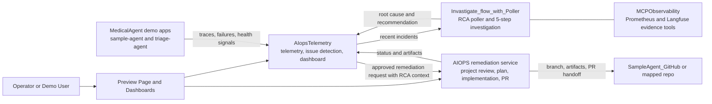
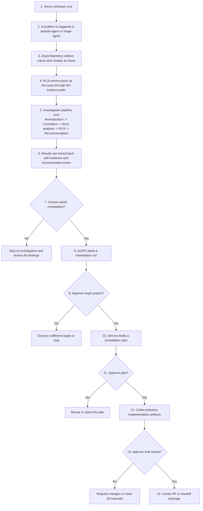

# AIOPS Repo

This repository is a working demo of an AI-assisted operations flow.

In simple terms, it shows how a system can:

1. notice that an application has a problem,
2. investigate what likely caused it,
3. suggest a safe fix,
4. wait for human approval,
5. prepare a code change and pull request,
6. keep the evidence and status visible end to end.

The workspace is built as a group of small services that run together locally.

## What A Non-Technical User Should Know

You can think of this project as an "incident-to-action" demo.

- `MedicalAgent` creates a realistic application that can fail under load.
- `AIopsTelemetry` notices problems and opens incidents.
- `Invastigate_flow_with_Poller` investigates those incidents and explains the likely cause.
- `AIOPS` prepares a remediation workflow with approval steps before code is changed.
- `SampleAgent_GitHub` acts as the target repository for the remediation flow.

If you only want to see the demo, start the stack and open the preview page. If you want technical setup details for a specific module, use that module's own README.

## Architecture Diagram



## End-To-End Flow Diagram



## Main Parts Of The Workspace

| Folder | Plain-English purpose |
|---|---|
| `AIopsTelemetry/` | The main operations hub. It receives telemetry, detects issues, shows dashboards, stores issue history, and starts remediation handoffs. |
| `Invastigate_flow_with_Poller/` | The investigation service. It polls incidents from telemetry and runs the multi-step RCA pipeline. |
| `AIOPS/` | The remediation engine. It resolves the target repo, drafts a plan, waits for approvals, prepares code changes, and can open a PR. |
| `MedicalAgent/` | The demo application that is intentionally easy to observe and stress. It also includes the dependent `triage-agent` service used in the cascade demo. |
| `SampleAgent_GitHub/` | A GitHub-facing copy of the sample app used as a remediation target. |
| `MCPObservability/` | A small observability helper that gives RCA agents bounded access to Prometheus and Langfuse evidence. |
| `demo/` | One-command local demo launcher, preview page, and helper scripts. |

Note: the folder name `Invastigate_flow_with_Poller` is spelled that way in the repository and is the service actually used by the demo.

## Fastest Way To Run The Demo

From the repository root:

```bash
./demo/start.sh
```

When it finishes, open:

- Preview page: `http://127.0.0.1:8088/aiops_preview.html`
- AIopsTelemetry dashboard: `http://localhost:7000`
- Operations dashboard (Japanese): `http://localhost:7000/ops_j`
- Conversational workbench: `http://localhost:7000/conversation_j`
- RCA service: `http://localhost:8000`
- Remediation service: `http://localhost:8005`
- Sample app: `http://localhost:8002`
- Dependent triage app: `http://localhost:8010`

To stop everything:

```bash
./demo/stop.sh
```

Runtime logs are written under:

```bash
.runtime/logs
```

## What Starts In The Demo

`./demo/start.sh` launches the full local story:

- `MedicalAgent` in Docker, including `sample-agent` and the dependent `triage-agent`
- `AIopsTelemetry` on port `7000`
- `Invastigate_flow_with_Poller` on port `8000`
- `AIOPS` remediation service on port `8005`
- the optional monitor UI on port `5173` if its frontend dependencies are already installed
- the demo preview page on port `8088`

## Key User-Facing Screens

- `/` on port `7000`: the main AIopsTelemetry dashboard for issues, telemetry, and general status.
- `/ops_j` on port `7000`: the Japanese operations dashboard for incident handling. It is the best screen for walking an operator through an active problem step by step.
- `/conversation_j` on port `7000`: the conversational workbench for a chat-style AIOps experience.

The operations dashboard at `/ops_j` is especially important in this repo because it combines several views in one place:

- an incident queue
- issue severity and business-impact context
- VM and component topology
- component diagnostics and related logs
- visual RCA journey
- an inline assistant for short summary, detailed report, and 5 Whys style explanation

## Typical Demo Story

The clearest demo path is:

1. Start the platform with `./demo/start.sh`.
2. Open the preview page and the telemetry dashboard.
3. Trigger a failure scenario so the sample system starts misbehaving.
4. Watch `AIopsTelemetry` create an issue.
5. Let the RCA service investigate and return a likely cause plus recommendation.
6. Start remediation only if a human reviewer agrees that action is needed.
7. Approve the proposed plan, review the generated artifacts, and then create the PR or handoff.

Useful scenario commands:

```bash
./demo/sample_agent_pod_pressure.sh
```

```bash
cd MedicalAgent
./scripts/run_cascade_threshold_scenario.sh
```

If you want low background activity running during the demo:

```bash
STEADY_LOAD_ENABLED=1 ./demo/start.sh
```

If you want a faster restart without rebuilding the Docker image:

```bash
REBUILD_MEDICAL=0 ./demo/start.sh
```

## Where Human Approval Happens

This platform is not designed to silently change production code.

The approval points are built into the remediation flow:

1. confirm the correct target project or repository,
2. approve the remediation plan,
3. review the generated implementation artifacts,
4. only then create the pull request or final handoff.

That makes the system easier to explain to business users, demo audiences, and engineering reviewers because the AI helps, but a person remains in control of risky actions.

## If You Are Setting This Up For The First Time

The demo start script assumes the local environments for the individual modules have already been prepared.

For first-time setup, a technical user should usually:

```bash
cp AIopsTelemetry/.env.example AIopsTelemetry/.env
cp MedicalAgent/.env.example MedicalAgent/.env
cp SampleAgent_GitHub/.env.example SampleAgent_GitHub/.env
cp Invastigate_flow_with_Poller/.env.example Invastigate_flow_with_Poller/.env
```

Important settings are the LLM keys and any local path overrides:

- `OPENAI_API_KEY` and related model settings for the sample applications
- `AIOPS_OPENAI_API_KEY` for telemetry and remediation support
- `WEB_SEARCH_AGENT_DIR` and `SAMPLE_AGENT_DIR` if agent code lives outside this workspace

For deep technical setup, troubleshooting, or module-specific development, read:

- [PRODUCT.md](PRODUCT.md)
- [AIopsTelemetry/README.md](AIopsTelemetry/README.md)
- [AIOPS/README.md](AIOPS/README.md)
- [MedicalAgent/README.md](MedicalAgent/README.md)
- [SampleAgent_GitHub/README.md](SampleAgent_GitHub/README.md)
